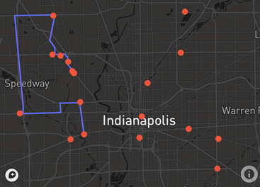

# Food-Truck-Tour 🚚
This project is done with three steps:
1. Get data with Google Map API.
   2. Search food trucks nearby Techpoint.
   3. Get the direction between each food trucks.
4. Plan a tour with a given starting point
5. Visualize the trucks and the route with Plotly Interative Dashboard.

The result is shown in the file **result.ipynb** while the code use during developing is in the folder **dev**.
#### Preview:

### Feature that have not been developed:
1. Create a completeness plan with the information I have organized.
2. Filter the opening time. Construct a trip base on this information.
3. Transportation choices other than driving.
4. More deliberate data dashboard. I tried using Plotly with Dash but you can't see the result on Github.

Related sources:
1. [Google Map API for Python](https://github.com/googlemaps/google-maps-services-python)
2. [How to add trace on Map](https://community.plotly.com/t/map-constrctions-with-python-plotly-and-dash/9829/8)
3. [Plotly](https://plotly.com/python/)

- Developer: Jimmy Liu
- Email: jimmystereo@gmail.com
- Feel free to contact 😉
